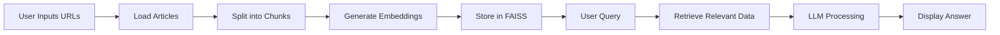

<p align="center">
  
</p>

# 📰 News Summarizer Agent


**News Summarizer Agent** is a **Streamlit-based AI application** that allows you to ingest news articles from URLs, convert them into **vector embeddings**, and ask natural language questions to get **context-aware AI responses**.

It’s ideal for **analysts, journalists, and researchers** who want quick insights from multiple articles. 🚀

---

## ⚡ Features

* 🖊️ **Dynamic URL Input** – Add multiple article URLs via sidebar
* 🌐 **Automated Web Scraping** – Extracts content from given links
* ✂️ **Smart Text Chunking** – Splits large text for better processing
* ⚡ **Semantic Search** – Fast retrieval using **FAISS vector store**
* 🧠 **AI-Powered Answers** – Uses **LLaMA 3.3 70B (via ChatGroq)**
* 💾 **Persistent Storage** – Save & reload embeddings
* 🐞 **Debug Mode** – Inspect retrieved chunks
* 🎨 **User-Friendly UI** – Clean Streamlit interface

---

## 📊 Workflow



---

## 🛠️ Tech Stack

* **Python 3.11+**
* **Streamlit** – UI Framework
* **LangChain** – LLM workflows & pipelines
* **FAISS** – Vector similarity search
* **HuggingFace Transformers** – Embeddings
* **ChatGroq (LLaMA 3.3 70B)** – LLM
* **dotenv** – Environment management
* **pickle** – Storage

---

## 🚀 Getting Started

```bash
1. Clone Repository
git clone https://github.com/Kamal516857/News_Summarizer_Agent.git
cd News_Summarizer_Agent

2. Install Dependencies
pip install -r requirements.txt

3. Setup Environment Variables
Create a `.env` file:

GROQ_API_KEY=your_api_key_here

4. Run the App
streamlit run app.py

Open in browser at http://localhost:8501.
```
```
```
## 📝 Usage

- Enter **1–3 news article URLs** in the sidebar  
- Click **"Process URLs"** to load, split, and embed articles  
- Ask any question in the main input box  
- Get **AI-generated answers** with retrieved chunk previews  

---

## 🛠️ Code Highlights

### 🔹 Vector Store Creation

```python
vectorstore = FAISS.from_documents(docs, embeddings)

with open("faiss_store.pkl", "wb") as f:
    pickle.dump(vectorstore, f)
````

### 🔹 LLM Q&A Chain

```python
chain = (
    {
        "context": RunnablePassthrough(
            lambda _: "\n\n".join(doc.page_content for doc in docs)
        ),
        "question": RunnablePassthrough(),
    }
    | prompt
    | llm
    | StrOutputParser()
)

result = chain.invoke(query)
```

---


#### You can access the website via **"https://news-summarizer-agent.streamlit.app/"**
