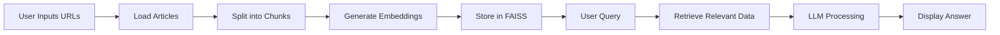

<p align="center">
  
</p>

# 📰 News Summarizer Agent


**News Summarizer Agent** is a **Streamlit-based AI application** that allows you to ingest news articles from URLs, convert them into **vector embeddings**, and ask natural language questions to get **context-aware AI responses**.

It’s ideal for **analysts, journalists, and researchers** who want quick insights from multiple articles. 🚀

---

## ⚡ Features

* 🖊️ **Dynamic URL Input** – Add multiple article URLs via sidebar
* 🌐 **Automated Web Scraping** – Extracts content from given links
* ✂️ **Smart Text Chunking** – Splits large text for better processing
* ⚡ **Semantic Search** – Fast retrieval using **FAISS vector store**
* 🧠 **AI-Powered Answers** – Uses **LLaMA 3.3 70B (via ChatGroq)**
* 💾 **Persistent Storage** – Save & reload embeddings
* 🐞 **Debug Mode** – Inspect retrieved chunks
* 🎨 **User-Friendly UI** – Clean Streamlit interface

---

## 📊 Workflow



---

## 🛠️ Tech Stack

* **Python 3.11+**
* **Streamlit** – UI Framework
* **LangChain** – LLM workflows & pipelines
* **FAISS** – Vector similarity search
* **HuggingFace Transformers** – Embeddings
* **ChatGroq (LLaMA 3.3 70B)** – LLM
* **dotenv** – Environment management
* **pickle** – Storage

---

## 🚀 Getting Started

### 1️⃣ Clone Repository

```bash
git clone https://github.com/Kamal516857/News_Summarizer_Agent.git
cd News_Summarizer_Agent
```

### 2️⃣ Install Dependencies

```bash
pip install -r requirements.txt
```

### 3️⃣ Setup Environment Variables

Create a `.env` file:

```env
GROQ_API_KEY=your_api_key_here
```

### 4️⃣ Run the App

```bash
streamlit run app.py
```

Open in browser:
👉 [http://localhost:8501](http://localhost:8501)

---

## 📝 Usage

1. Enter **1–10 news URLs** in the sidebar
2. Click **"Process URLs"**
3. Ask your question in the input box
4. View **AI-generated answers + retrieved context**

---

## 🔧 Code Highlights

### Vector Store Creation

```python
vectorstore = FAISS.from_documents(docs, embeddings)
with open("faiss_store.pkl", "wb") as f:
    pickle.dump(vectorstore, f)
```

### LLM Q&A Chain

```python
chain = (
    {
        "context": RunnablePassthrough(lambda _: "\n\n".join(doc.page_content for doc in docs)),
        "question": RunnablePassthrough(),
    }
    | prompt
    | llm
    | StrOutputParser()
)

result = chain.invoke(query)
```


#### You can access the website via **"https://news-summarizer-agent.streamlit.app/"**
